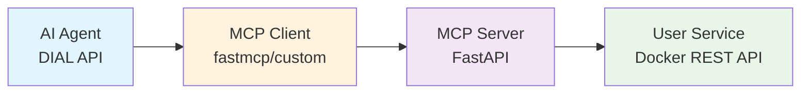

# AI-DIAL MCP Advanced Documentation

> **Educational Project**: Python implementation demonstrating the complete lifecycle of Model Context Protocol (MCP) servers and clients for AI agent tool integration.

## 📚 Table of Contents

- [Overview](#overview)
- [Quick Start](#quick-start)
- [Documentation Index](#documentation-index)
- [Learning Objectives](#learning-objectives)
- [Project Status](#project-status)
- [Getting Help](#getting-help)

## Overview

This project is a comprehensive learning resource for building AI agents with MCP (Model Context Protocol) tool support. It demonstrates:

- **Server-side tool development** with FastAPI and MCP protocol compliance
- **Dual client implementations**: framework-based (`fastmcp`) and pure Python (educational)
- **AI agent orchestration** using DIAL API (Azure OpenAI) with tool execution
- **Session management** and JSON-RPC 2.0 over HTTP/SSE streaming
- **User management tools** backed by a Docker-based mock REST API



### Technology Stack

- **Python**: 3.11+ with async/await patterns
- **Frameworks**: FastAPI (server), `fastmcp` (client), aiohttp (custom client)
- **Protocols**: JSON-RPC 2.0, Server-Sent Events (SSE), HTTP streaming
- **AI Integration**: Azure OpenAI via DIAL API
- **Dependencies**: Pydantic (validation), requests (sync HTTP), openai (LLM client)

## Quick Start

### 1. Prerequisites

- Python 3.11 or higher
- Docker Desktop (for user service mock)
- EPAM VPN connection (for DIAL API access)
- DIAL API key ([get key](https://support.epam.com/ess?id=sc_cat_item&table=sc_cat_item&sys_id=910603f1c3789e907509583bb001310c))

### 2. Environment Setup

```bash
# Clone repository (assumed complete)
cd ai-dial-mcp-advanced

# Create virtual environment
python -m venv dial_mcp_advanced
source dial_mcp_advanced/bin/activate  # macOS/Linux
# .\dial_mcp_advanced\Scripts\activate  # Windows

# Install dependencies
pip install -r requirements.txt

# Set API key
export DIAL_API_KEY='your_dial_api_key_here'
```

### 3. Start Services

```bash
# Terminal 1: Start user service (Docker)
docker-compose up -d

# Terminal 2: Start MCP server
python mcp_server/server.py
# Server runs on http://localhost:8006

# Terminal 3: Run AI agent
python agent/app.py
```

### 4. Test Query

```text
Check if Arkadiy Dobkin present as a user, if not then search info about him in the web and add him
```

This query demonstrates:
- User search via `search_users` tool (local MCP server)
- Web search via `fetch` tool (remote MCP server - **TODO**: not yet integrated)
- User creation via `add_user` tool (local MCP server)

## Documentation Index

### Core Documentation

| Document | Description | Audience |
|----------|-------------|----------|
| [Architecture](./architecture.md) | System design, modules, data flow, protocol mechanics | Developers, architects |
| [API Reference](./api.md) | MCP endpoints, tool schemas, JSON-RPC methods | Integration developers |
| [Setup Guide](./setup.md) | Installation, configuration, IDE setup | New contributors |
| [Testing Guide](./testing.md) | Test strategy, Postman collection, validation | QA, developers |

### Supporting Documentation

- [Glossary](./glossary.md) - MCP/JSON-RPC/SSE terminology
- [Roadmap](./roadmap.md) - Implementation TODOs and milestones
- [ADR-001](./adr/ADR-001-dual-client-implementation.md) - Rationale for framework + pure Python clients
- [ADR-002](./adr/ADR-002-session-management-strategy.md) - Session lifecycle design decisions

## Learning Objectives

By completing this project, you will gain hands-on experience with:

### 1. MCP Protocol Implementation
- JSON-RPC 2.0 request/response handling
- Session lifecycle management (initialize → notify → operate)
- Tool discovery (`tools/list`) and execution (`tools/call`)
- Server-Sent Events (SSE) streaming

### 2. Server-Side Tool Development
- Abstract base class patterns for extensible tools
- Pydantic schema generation for OpenAI/Claude compatibility
- Async REST API integration
- Error handling and validation

### 3. Client Integration Patterns
- Framework abstraction (`fastmcp` library)
- Pure Python protocol implementation (educational)
- HTTP connection pooling and timeout handling
- SSE response parsing

### 4. AI Agent Orchestration
- Tool call detection from streaming LLM responses
- Multi-tool execution and result aggregation
- Message history management
- Recursive agent loops (tool results → next LLM call)

### 5. Distributed Systems Concepts
- Session-based state management
- Protocol negotiation and capability exchange
- Async/await patterns for I/O-bound operations
- Error propagation across service boundaries

## Project Status

### ✅ Implemented

- [x] MCP request/response models ([models/](../mcp_server/models/))
- [x] Abstract tool base classes ([tools/base.py](../mcp_server/tools/base.py))
- [x] Framework-based MCP client ([mcp_client.py](../agent/clients/mcp_client.py))
- [x] DIAL API integration ([dial_client.py](../agent/clients/dial_client.py))
- [x] User service REST client ([user_client.py](../mcp_server/tools/users/user_client.py))

### 🚧 TODO (Main Learning Tasks)

- [ ] Complete MCP server core ([mcp_server.py](../mcp_server/services/mcp_server.py)) - **Step 1**
- [ ] Implement FastAPI endpoint handlers ([server.py](../mcp_server/server.py)) - **Step 2**
- [ ] Complete user management tools (create/update/delete/search) - **Step 3**
- [ ] Implement pure Python MCP client ([custom_mcp_client.py](../agent/clients/custom_mcp_client.py)) - **Step 4**
- [ ] Test agent with both client implementations - **Step 5**
- [ ] Integrate remote fetch MCP server for web search - **Step 6** (stretch goal)

**Current Phase**: Server implementation and tool registration

See [Roadmap](./roadmap.md) for detailed task breakdown and estimated effort.

## Getting Help

### Common Issues

1. **Connection Errors**: Ensure Docker container is running (`docker ps`) and MCP server started
2. **401 Unauthorized**: Verify DIAL API key set and VPN connected
3. **400 Session Not Ready**: Must call `notifications/initialized` after `initialize` (see [Testing Guide](./testing.md))
4. **Module Import Errors**: Activate virtual environment and verify `pip install -r requirements.txt` completed

### Resources

- [MCP Specification](https://modelcontextprotocol.io/specification/2025-06-18/basic) - Official protocol docs
- [Postman Collection](../mcp.postman_collection.json) - Import for API testing
- [Copilot Instructions](../.github/copilot-instructions.md) - Project-specific AI assistance context

### Testing with Postman

1. Import [mcp.postman_collection.json](../mcp.postman_collection.json)
2. Execute requests in order:
   - `init` → Capture `Mcp-Session-Id` from response header
   - `init-notification` → Paste session ID into header
   - `tools/list` → View available tools
   - `tools/call` → Test specific tool (edit params in body)

### Support Channels

- **Internal**: EPAM technical forums or project Slack
- **External**: [Model Context Protocol discussions](https://github.com/modelcontextprotocol/specification/discussions)

---

**Next Steps**: Read [Architecture](./architecture.md) for system design overview, then proceed to [Setup Guide](./setup.md) for detailed installation.
