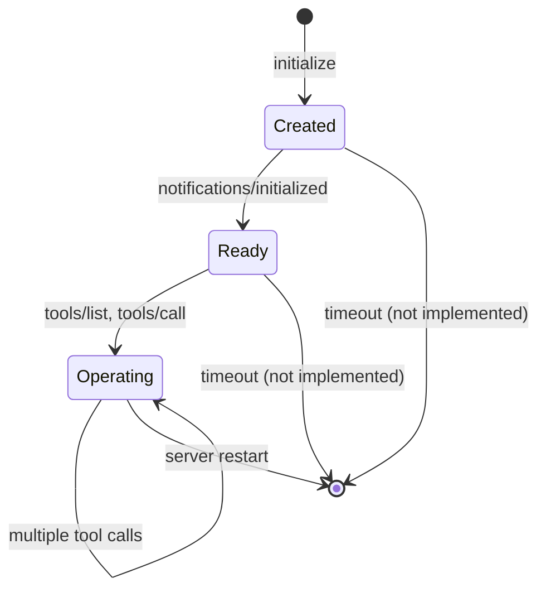

# ADR-002: Session Management Strategy

## Status

**Accepted** (2025-12-30)

## Context

MCP protocol requires stateful sessions between client and server to:
1. Track initialization status
2. Enforce operation readiness (prevent tool calls before `notifications/initialized`)
3. Correlate requests across HTTP connections

### Problem Statement

How should we manage session state in a learning-focused MCP server implementation?

**Key Questions**:
- Where to store session state (in-memory, database, Redis)?
- What session lifecycle model to enforce?
- How to handle invalid/expired sessions?
- Should sessions persist across server restarts?

### Constraints

- **Learning Project**: Simplicity prioritized over production features
- **Single Instance**: No multi-worker deployment (Uvicorn single process)
- **Short-Lived Sessions**: Agent interactions typically < 5 minutes
- **No Authentication**: Session ID only security mechanism

## Decision

**Implement in-memory session management with strict lifecycle enforcement:**

1. **Storage**: Dictionary mapping UUID → `MCPSession` object
   ```python
   self.sessions: dict[str, MCPSession] = {}
   ```

2. **Lifecycle**:
   ```
   initialize → notifications/initialized → tools/list|tools/call
   ```
   Enforce via `ready_for_operation` boolean flag.

3. **Session Creation**: Generate UUID on `initialize`, return in `Mcp-Session-Id` header

4. **Validation**: Block tool operations if:
   - Session ID missing from request header
   - Session ID not found in `self.sessions`
   - `session.ready_for_operation == False`

5. **Expiration**: None (sessions live until server restart)

6. **Cleanup**: No automatic cleanup (acceptable for learning scope)

## Rationale

### Benefits of In-Memory Storage

1. **Simplicity**:
   - No external dependencies (Redis, SQLite)
   - Zero configuration overhead
   - Easy to reason about (Python dict operations)

2. **Performance**:
   - O(1) lookups by session ID
   - No network latency (Redis) or disk I/O (SQLite)
   - Sufficient for single-threaded Uvicorn

3. **Learning Focus**:
   - Concepts (state management, lifecycle) not infrastructure (databases)
   - Students understand session mechanics without deployment complexity

4. **Debugging**:
   - Inspect sessions with print/debugger directly
   - No query language or connection issues

### Benefits of Strict Lifecycle

1. **Protocol Compliance**:
   - MCP spec requires `notifications/initialized` before tool operations
   - Enforcing prevents client implementation bugs

2. **Educational Value**:
   - Demonstrates state machine pattern
   - Forces understanding of handshake sequence
   - Common mistake: skipping notification step (400 error teaches lesson)

3. **Error Messages**:
   - Clear feedback: "Session not ready. Send notifications/initialized first"
   - Helps students debug Postman/client issues

### Trade-Offs Accepted

| Aspect | Trade-Off | Justification |
|--------|-----------|---------------|
| **Persistence** | Sessions lost on restart | Learning project, no production uptime requirement |
| **Expiration** | No TTL, potential memory leak | Short-lived sessions, server restarted frequently during dev |
| **Concurrency** | Single-threaded, no locking | Uvicorn default (1 worker), sufficient for demo workload |
| **Security** | UUID only, no API keys | Educational scope, runs on localhost |

## Implementation Details

### MCPSession Data Structure

```python
class MCPSession:
    """
    Represents an MCP client session with state tracking.
    
    Lifecycle:
    1. Created on `initialize` with unique UUID
    2. `ready_for_operation` set to False
    3. After `notifications/initialized`, flag set to True
    4. Tool operations allowed only when flag is True
    """
    def __init__(self, session_id: str):
        self.session_id = session_id
        self.ready_for_operation = False  # Critical: blocks tools until True
        self.created_at = asyncio.get_event_loop().time()
        self.last_activity = self.created_at
```

**Key Attributes**:
- `session_id`: UUID v4 (cryptographically random, collision-resistant)
- `ready_for_operation`: Boolean guard for tool operations
- `created_at`: Timestamp for potential expiration logic (not used)
- `last_activity`: Updated on each request (for idle tracking)

### Session Lifecycle Flow



### Validation Logic

**In MCPServer Methods**:

```python
def get_session(self, session_id: str) -> MCPSession | None:
    """Retrieve session and update activity timestamp"""
    session = self.sessions.get(session_id)
    if session:
        session.last_activity = asyncio.get_event_loop().time()
    return session

def handle_tools_list(self, request: MCPRequest, session_id: str) -> MCPResponse:
    """Validate session ready before listing tools"""
    session = self.get_session(session_id)
    if not session:
        return self._error_response(request.id, -32600, "Invalid session ID")
    if not session.ready_for_operation:
        return self._error_response(request.id, -32600, "Session not ready")
    # ... proceed with tool listing
```

**In FastAPI Endpoint**:

```python
@app.post("/mcp")
async def handle_mcp_request(
    request: MCPRequest,
    mcp_session_id: Optional[str] = Header(None, alias="Mcp-Session-Id")
):
    # Allow initialize without session ID
    if request.method == "initialize":
        response_obj, new_session_id = mcp_server.handle_initialize(request)
        response.headers["Mcp-Session-Id"] = new_session_id
        return StreamingResponse(...)
    
    # All other methods require session ID
    if not mcp_session_id:
        return JSONResponse(
            {"error": "Session ID required for this operation"},
            status_code=400
        )
    
    # Route to appropriate handler (validates session internally)
```

### Error Scenarios

| Scenario | Detection | Response |
|----------|-----------|----------|
| Missing session ID | `mcp_session_id` header absent | HTTP 400: "Session ID required" |
| Invalid session ID | `get_session()` returns None | JSON-RPC error -32600: "Invalid session ID" |
| Session not ready | `session.ready_for_operation == False` | JSON-RPC error -32600: "Session not ready" |
| Unknown method | Method routing fails | JSON-RPC error -32601: "Method not found" |

## Alternatives Considered

### Alternative 1: Stateless (JWT Tokens)

**Description**: Encode session state in JWT token, no server-side storage.

**Rejected Reasons**:
- **MCP Spec**: Protocol expects session ID in header, not self-contained token
- **Complexity**: JWT signing/verification overkill for learning project
- **State Tracking**: `ready_for_operation` flag needs server-side storage
- **Debugging**: Token decoding adds friction vs direct dict inspection

---

### Alternative 2: Redis Session Store

**Description**: External Redis instance for session persistence.

**Rejected Reasons**:
- **Infrastructure**: Requires Redis installation/configuration
- **Overkill**: Persistence unnecessary for learning project
- **Complexity**: Connection management, serialization, error handling
- **Learning Focus**: Shifts attention from MCP to Redis operations

**When to Reconsider**: Multi-worker deployment, production readiness.

---

### Alternative 3: SQLite Session Database

**Description**: Persistent SQLite database for session storage.

**Rejected Reasons**:
- **Disk I/O**: Slower than in-memory (unnecessary latency)
- **Schema Migration**: Added complexity for learning scope
- **Locking**: Potential contention in async context
- **Persistence**: Not needed (sessions short-lived, restart acceptable)

**When to Reconsider**: Long-running sessions, audit trail requirements.

---

### Alternative 4: No Session Management

**Description**: Stateless server, allow tool operations without initialization.

**Rejected Reasons**:
- **Protocol Violation**: MCP spec requires session handshake
- **Learning Value**: Misses opportunity to teach state management
- **Error Handling**: Can't validate client followed correct sequence
- **Production Pattern**: Real servers always track sessions

---

## Consequences

### Positive

1. **Simplicity**: Minimal code, no external dependencies
2. **Performance**: Fast O(1) lookups, no I/O blocking
3. **Debuggability**: Direct Python dict inspection
4. **Educational**: Clear state machine pattern, lifecycle enforcement
5. **Protocol Compliance**: Strict validation catches client bugs

### Negative

1. **No Persistence**: Sessions lost on server restart
2. **Memory Leak Potential**: No expiration/cleanup (sessions accumulate)
3. **Single-Threaded**: Won't scale to multi-worker Uvicorn
4. **No Security**: UUID only protection (weak for public deployment)

### Mitigation Strategies

**For Memory Leaks**:
- Document limitation in README
- Add TODO comment for expiration logic
- Acceptable risk given short development sessions

**For Persistence**:
- Not needed for learning scope
- If required, see "Future Enhancements" (Redis ADR)

**For Scalability**:
- Out of scope for learning project
- Multi-worker deployment requires shared session store (Redis)

**For Security**:
- Runs on localhost only
- Production deployment would add API keys, rate limiting

## Future Enhancements

### Session Expiration (Low Priority)

**Implementation**:
```python
def _cleanup_expired_sessions(self):
    """Remove sessions idle > 30 minutes"""
    now = asyncio.get_event_loop().time()
    expired = [
        sid for sid, sess in self.sessions.items()
        if now - sess.last_activity > 1800  # 30 min
    ]
    for sid in expired:
        del self.sessions[sid]

# Call periodically via asyncio.create_task()
```

**Effort**: 1 hour  
**Value**: Prevents memory leak in long-running deployments

---

### Redis Session Store (Medium Priority)

**When Needed**: Multi-worker Uvicorn, session persistence

**Implementation**:
```python
import aioredis

class RedisSessionManager:
    def __init__(self, redis_url: str):
        self.redis = aioredis.from_url(redis_url)
    
    async def create_session(self, session_id: str):
        await self.redis.hset(f"session:{session_id}", mapping={
            "ready": "false",
            "created_at": time.time()
        })
        await self.redis.expire(f"session:{session_id}", 3600)  # 1 hour TTL
```

**Effort**: 2-3 hours  
**Value**: Production-ready session management

---

### Session Metrics (Low Priority)

**Track**:
- Active sessions count
- Session duration histogram
- Tool calls per session

**Implementation**: Prometheus metrics or structured logging

**Effort**: 1-2 hours  
**Value**: Observability for production

---

## Validation

### Success Criteria

- [ ] Client receives UUID in `Mcp-Session-Id` header after `initialize`
- [ ] `tools/list` blocked without `notifications/initialized` (HTTP 400)
- [ ] Multiple clients can have simultaneous independent sessions
- [ ] Session ID validated on every request (invalid ID → error)
- [ ] Sessions persist across multiple tool calls (same session ID)

### Testing Checklist

**Postman Validation**:
1. Send `initialize` → Capture session ID
2. Send `tools/list` without notification → Expect 400
3. Send `notifications/initialized` → Expect 202
4. Send `tools/list` → Expect success with tools
5. Restart server → Repeat step 1 (new session ID)

**Concurrent Sessions**:
1. Open two Postman tabs
2. Initialize both → Verify different session IDs
3. Call tools in parallel → Verify no interference

**Invalid Session**:
1. Send `tools/list` with random UUID → Expect "Invalid session ID"
2. Send without `Mcp-Session-Id` header → Expect "Session ID required"

## Related Decisions

- See [ADR-001](./ADR-001-dual-client-implementation.md) for client-side session handling
- See [Architecture](../architecture.md#session-lifecycle) for protocol flow details

## References

- [MCP Session Lifecycle](https://modelcontextprotocol.io/specification/2025-06-18/basic#lifecycle)
- [Python uuid Module](https://docs.python.org/3/library/uuid.html)
- [FastAPI Headers](https://fastapi.tiangolo.com/advanced/header-params/)
- [State Machine Pattern](https://refactoring.guru/design-patterns/state)

---

**Date**: 2025-12-30  
**Author**: Project Team  
**Reviewers**: N/A (Learning project)  
**Next Review**: After production deployment consideration
