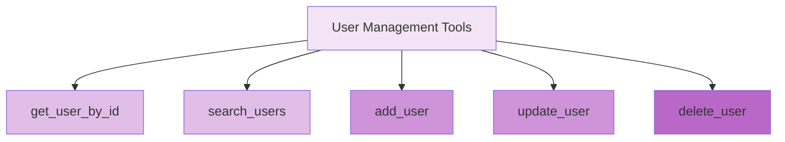

# API Reference

## Table of Contents

- [Overview](#overview)
- [MCP Endpoint](#mcp-endpoint)
- [JSON-RPC Methods](#json-rpc-methods)
- [Tool Catalog](#tool-catalog)
- [Data Models](#data-models)
- [Error Codes](#error-codes)

## Overview

This document describes the MCP (Model Context Protocol) server API exposed at `http://localhost:8006/mcp`. The API follows JSON-RPC 2.0 specification with Server-Sent Events (SSE) streaming.

### Base URL

```
http://localhost:8006/mcp
```

### Protocol

- **Format**: JSON-RPC 2.0 over HTTP POST
- **Content-Type**: `application/json`
- **Accept**: `application/json, text/event-stream` (both required)
- **Session Header**: `Mcp-Session-Id` (after initialization)

## MCP Endpoint

### POST /mcp

Single endpoint handling all MCP protocol methods via JSON-RPC.

#### Request Headers

| Header | Required | Description |
|--------|----------|-------------|
| `Content-Type` | Yes | Must be `application/json` |
| `Accept` | Yes | Must include both `application/json` and `text/event-stream` |
| `Mcp-Session-Id` | Conditional | Required for all methods except `initialize` |

#### Response Headers

| Header | When Present | Description |
|--------|--------------|-------------|
| `Mcp-Session-Id` | After `initialize` | UUID session identifier for subsequent requests |
| `Content-Type` | Always | `text/event-stream` for SSE streaming |

#### Response Format (SSE)

All responses stream as Server-Sent Events:

```
data: {"jsonrpc": "2.0", "id": 1, "result": {...}}
data: [DONE]
```

Client should read until `[DONE]` marker.

## JSON-RPC Methods

### 1. initialize

Establish MCP session and negotiate capabilities.

#### Request

```json
{
  "jsonrpc": "2.0",
  "id": 1,
  "method": "initialize",
  "params": {
    "protocolVersion": "2024-11-05",
    "capabilities": {
      "tools": {}
    },
    "clientInfo": {
      "name": "my-mcp-client",
      "version": "1.0.0"
    }
  }
}
```

#### Response

```json
{
  "jsonrpc": "2.0",
  "id": 1,
  "result": {
    "protocolVersion": "2024-11-05",
    "capabilities": {
      "tools": {}
    },
    "serverInfo": {
      "name": "custom-ums-mcp-server",
      "version": "1.0.0"
    }
  }
}
```

**Response Headers**:
- `Mcp-Session-Id`: `<uuid>` (capture for subsequent requests)

#### Error Cases

- **406 Not Acceptable**: Client `Accept` header missing required types
- **400 Bad Request**: Invalid JSON-RPC structure

---

### 2. notifications/initialized

Signal readiness for tool operations (fire-and-forget notification).

#### Request

```json
{
  "jsonrpc": "2.0",
  "method": "notifications/initialized"
}
```

**Note**: No `id` field (JSON-RPC notification pattern).

**Headers**:
- `Mcp-Session-Id`: `<uuid>` (from initialize response)

#### Response

**HTTP 202 Accepted** with empty body.

#### Error Cases

- **400 Bad Request**: Missing or invalid session ID

---

### 3. tools/list

Retrieve available tools with JSON Schema definitions.

#### Request

```json
{
  "jsonrpc": "2.0",
  "id": 2,
  "method": "tools/list"
}
```

**Headers**:
- `Mcp-Session-Id`: `<uuid>`

#### Response

```json
{
  "jsonrpc": "2.0",
  "id": 2,
  "result": {
    "tools": [
      {
        "name": "get_user_by_id",
        "description": "Retrieve a user by their unique ID",
        "inputSchema": {
          "type": "object",
          "properties": {
            "id": {
              "type": "integer",
              "description": "User ID"
            }
          },
          "required": ["id"]
        }
      },
      {
        "name": "search_users",
        "description": "Search users by name pattern",
        "inputSchema": {
          "type": "object",
          "properties": {
            "name": {
              "type": "string",
              "description": "Name pattern to search"
            }
          },
          "required": ["name"]
        }
      }
      // ... more tools
    ]
  }
}
```

#### Error Cases

- **400 Bad Request**: Session not ready (missing `notifications/initialized`)
- **400 Bad Request**: Invalid session ID

---

### 4. tools/call

Execute a specific tool with provided arguments.

#### Request

```json
{
  "jsonrpc": "2.0",
  "id": 3,
  "method": "tools/call",
  "params": {
    "name": "search_users",
    "arguments": {
      "name": "Arkadiy"
    }
  }
}
```

**Headers**:
- `Mcp-Session-Id`: `<uuid>`

#### Success Response

```json
{
  "jsonrpc": "2.0",
  "id": 3,
  "result": {
    "content": [
      {
        "type": "text",
        "text": "```\n  id: 123\n  name: Arkadiy\n  surname: Dobkin\n  email: arkadiy.dobkin@epam.com\n```\n"
      }
    ]
  }
}
```

#### Error Response (Tool Execution Failed)

```json
{
  "jsonrpc": "2.0",
  "id": 3,
  "result": {
    "content": [
      {
        "type": "text",
        "text": "User not found"
      }
    ],
    "isError": true
  }
}
```

#### Error Cases

- **400 Bad Request**: Session not ready
- **-32601**: Method not found (invalid tool name)
- **-32602**: Invalid params (schema validation failure)

---

## Tool Catalog

### User Management Tools

All tools operate on the User Service REST API at `http://localhost:8041`.



---

### get_user_by_id

Retrieve user details by numeric ID.

#### Input Schema

```json
{
  "type": "object",
  "properties": {
    "id": {
      "type": "integer",
      "description": "User ID"
    }
  },
  "required": ["id"]
}
```

#### Example Request

```json
{
  "jsonrpc": "2.0",
  "id": 1,
  "method": "tools/call",
  "params": {
    "name": "get_user_by_id",
    "arguments": {
      "id": 123
    }
  }
}
```

#### Example Response

```json
{
  "jsonrpc": "2.0",
  "id": 1,
  "result": {
    "content": [
      {
        "type": "text",
        "text": "```\n  id: 123\n  name: John\n  surname: Doe\n  email: john.doe@example.com\n  phone: +1234567890\n  date_of_birth: 1985-06-15\n  gender: Male\n  company: EPAM Systems\n  salary: 120000.0\n  about_me: Software Engineer\n```\n"
      }
    ]
  }
}
```

#### REST Mapping

- **HTTP Method**: GET
- **Endpoint**: `/v1/users/{id}`
- **Status Codes**: 200 (found), 404 (not found)

---

### search_users

Query users by name pattern (partial match).

#### Input Schema

```json
{
  "type": "object",
  "properties": {
    "name": {
      "type": "string",
      "description": "Name pattern to search (partial match)"
    }
  },
  "required": ["name"]
}
```

#### Example Request

```json
{
  "jsonrpc": "2.0",
  "id": 2,
  "method": "tools/call",
  "params": {
    "name": "search_users",
    "arguments": {
      "name": "Arkadiy"
    }
  }
}
```

#### Example Response

```json
{
  "jsonrpc": "2.0",
  "id": 2,
  "result": {
    "content": [
      {
        "type": "text",
        "text": "```\n  id: 456\n  name: Arkadiy\n  surname: Dobkin\n  ...\n```\n```\n  id: 789\n  name: Arkadiy\n  surname: Smith\n  ...\n```\n"
      }
    ]
  }
}
```

#### REST Mapping

- **HTTP Method**: GET
- **Endpoint**: `/v1/users/search?name={pattern}`
- **Status Codes**: 200 (found), 200 with empty list (no matches)

---

### add_user

Create new user with detailed profile information.

#### Input Schema

See [UserCreate](#usercreate) model below. Key fields:

- `name` (required): First name
- `surname` (required): Last name
- `email` (required): Email address
- `about_me` (required): Biography
- `phone`, `date_of_birth`, `address`, `company`, `salary` (optional)

#### Example Request

```json
{
  "jsonrpc": "2.0",
  "id": 3,
  "method": "tools/call",
  "params": {
    "name": "add_user",
    "arguments": {
      "name": "Arkadiy",
      "surname": "Dobkin",
      "email": "arkadiy.dobkin@epam.com",
      "about_me": "Co-founder and CEO of EPAM Systems",
      "company": "EPAM Systems"
    }
  }
}
```

#### Example Response

```json
{
  "jsonrpc": "2.0",
  "id": 3,
  "result": {
    "content": [
      {
        "type": "text",
        "text": "User created with ID: 1001\n```\n  id: 1001\n  name: Arkadiy\n  surname: Dobkin\n  email: arkadiy.dobkin@epam.com\n  company: EPAM Systems\n  about_me: Co-founder and CEO of EPAM Systems\n```\n"
      }
    ]
  }
}
```

#### REST Mapping

- **HTTP Method**: POST
- **Endpoint**: `/v1/users`
- **Status Codes**: 201 (created), 400 (validation error), 409 (duplicate email)

---

### update_user

Modify existing user fields (partial update).

#### Input Schema

Includes `id` (required) plus any fields from [UserUpdate](#userupdate) model.

```json
{
  "type": "object",
  "properties": {
    "id": {
      "type": "integer",
      "description": "User ID to update"
    },
    "name": {"type": "string"},
    "surname": {"type": "string"},
    "email": {"type": "string"},
    "company": {"type": "string"},
    "salary": {"type": "number"}
    // ... all fields optional except id
  },
  "required": ["id"]
}
```

#### Example Request

```json
{
  "jsonrpc": "2.0",
  "id": 4,
  "method": "tools/call",
  "params": {
    "name": "update_user",
    "arguments": {
      "id": 1001,
      "company": "EPAM",
      "salary": 150000.0
    }
  }
}
```

#### REST Mapping

- **HTTP Method**: PATCH
- **Endpoint**: `/v1/users/{id}`
- **Status Codes**: 200 (updated), 404 (not found), 400 (validation error)

---

### delete_user

Remove user by ID (irreversible).

#### Input Schema

```json
{
  "type": "object",
  "properties": {
    "id": {
      "type": "integer",
      "description": "User ID to delete"
    }
  },
  "required": ["id"]
}
```

#### Example Request

```json
{
  "jsonrpc": "2.0",
  "id": 5,
  "method": "tools/call",
  "params": {
    "name": "delete_user",
    "arguments": {
      "id": 1001
    }
  }
}
```

#### Example Response

```json
{
  "jsonrpc": "2.0",
  "id": 5,
  "result": {
    "content": [
      {
        "type": "text",
        "text": "User with ID 1001 deleted successfully"
      }
    ]
  }
}
```

#### REST Mapping

- **HTTP Method**: DELETE
- **Endpoint**: `/v1/users/{id}`
- **Status Codes**: 200 (deleted), 404 (not found)

---

## Data Models

### UserCreate

Full user profile for creation (Pydantic schema: [user_info.py](../mcp_server/models/user_info.py)).

```json
{
  "type": "object",
  "properties": {
    "name": {"type": "string", "description": "First name"},
    "surname": {"type": "string", "description": "Last name"},
    "email": {"type": "string", "description": "Email address"},
    "phone": {"type": "string", "description": "Phone number"},
    "date_of_birth": {"type": "string", "description": "Birth date (ISO format)"},
    "address": {
      "type": "object",
      "properties": {
        "country": {"type": "string"},
        "city": {"type": "string"},
        "street": {"type": "string"},
        "flat_house": {"type": "string"}
      }
    },
    "gender": {"type": "string"},
    "company": {"type": "string"},
    "salary": {"type": "number"},
    "about_me": {"type": "string", "description": "Biography"},
    "credit_card": {
      "type": "object",
      "properties": {
        "num": {"type": "string"},
        "cvv": {"type": "string"},
        "exp_date": {"type": "string"}
      }
    }
  },
  "required": ["name", "surname", "email", "about_me"]
}
```

### UserUpdate

Partial update schema (all fields optional except `id` at tool level).

```json
{
  "type": "object",
  "properties": {
    "name": {"type": "string"},
    "surname": {"type": "string"},
    "email": {"type": "string"},
    "phone": {"type": "string"},
    "date_of_birth": {"type": "string"},
    "address": {"$ref": "#/definitions/Address"},
    "gender": {"type": "string"},
    "company": {"type": "string"},
    "salary": {"type": "number"},
    "about_me": {"type": "string"},
    "credit_card": {"$ref": "#/definitions/CreditCard"}
  }
}
```

### Address

Nested object for user location.

```json
{
  "type": "object",
  "properties": {
    "country": {"type": "string"},
    "city": {"type": "string"},
    "street": {"type": "string"},
    "flat_house": {"type": "string"}
  },
  "required": ["country", "city", "street", "flat_house"]
}
```

### CreditCard

Payment information (sensitive data).

```json
{
  "type": "object",
  "properties": {
    "num": {"type": "string", "description": "Card number"},
    "cvv": {"type": "string", "description": "Security code"},
    "exp_date": {"type": "string", "description": "Expiration date"}
  },
  "required": ["num", "cvv", "exp_date"]
}
```

---

## Error Codes

### HTTP Status Codes

| Code | Reason | Description |
|------|--------|-------------|
| 200 | OK | Successful response with SSE stream |
| 202 | Accepted | Notification processed (no response body) |
| 400 | Bad Request | Invalid session ID or session not ready |
| 406 | Not Acceptable | Missing required Accept header types |
| 500 | Internal Server Error | Unhandled exception |

### JSON-RPC Error Codes

Returned in `error` field of JSON-RPC response (not HTTP errors).

| Code | Message | Description |
|------|---------|-------------|
| -32700 | Parse error | Invalid JSON in request body |
| -32600 | Invalid request | Missing required JSON-RPC fields |
| -32601 | Method not found | Tool name not in registry |
| -32602 | Invalid params | Arguments don't match tool schema |
| -32603 | Internal error | Server-side exception |

### MCP-Specific Errors

| HTTP | Condition | Response |
|------|-----------|----------|
| 400 | Missing session ID | `{"error": "Session ID required for this operation"}` |
| 400 | Session not ready | `{"error": "Session not ready. Send notifications/initialized first"}` |
| 400 | Invalid session ID | `{"error": "Invalid session ID"}` |

### Tool Execution Errors

Returned as `result.isError: true` (not JSON-RPC error).

#### Example

```json
{
  "jsonrpc": "2.0",
  "id": 3,
  "result": {
    "content": [
      {
        "type": "text",
        "text": "HTTP 404: User not found"
      }
    ],
    "isError": true
  }
}
```

**Interpretation**: Tool executed but failed (e.g., user ID doesn't exist). Not a protocol error.

---

## Client Implementation Guide

### Authentication Flow

```python
import aiohttp

async def connect_to_mcp():
    session = aiohttp.ClientSession()
    
    # Step 1: Initialize
    init_response = await session.post(
        "http://localhost:8006/mcp",
        json={
            "jsonrpc": "2.0",
            "id": 1,
            "method": "initialize",
            "params": {
                "protocolVersion": "2024-11-05",
                "capabilities": {"tools": {}},
                "clientInfo": {"name": "my-client", "version": "1.0.0"}
            }
        },
        headers={"Accept": "application/json, text/event-stream"}
    )
    
    # Capture session ID
    session_id = init_response.headers["Mcp-Session-Id"]
    
    # Step 2: Notify ready
    await session.post(
        "http://localhost:8006/mcp",
        json={
            "jsonrpc": "2.0",
            "method": "notifications/initialized"
        },
        headers={
            "Mcp-Session-Id": session_id,
            "Accept": "application/json, text/event-stream"
        }
    )
    
    return session, session_id
```

### Tool Discovery

```python
async def list_tools(session, session_id):
    response = await session.post(
        "http://localhost:8006/mcp",
        json={
            "jsonrpc": "2.0",
            "id": 2,
            "method": "tools/list"
        },
        headers={"Mcp-Session-Id": session_id}
    )
    
    # Parse SSE response
    async for line in response.content:
        line_str = line.decode('utf-8').strip()
        if line_str.startswith('data: '):
            data = line_str[6:]
            if data != '[DONE]':
                return json.loads(data)
```

### Tool Execution

```python
async def call_tool(session, session_id, tool_name, arguments):
    response = await session.post(
        "http://localhost:8006/mcp",
        json={
            "jsonrpc": "2.0",
            "id": 3,
            "method": "tools/call",
            "params": {
                "name": tool_name,
                "arguments": arguments
            }
        },
        headers={"Mcp-Session-Id": session_id}
    )
    
    # Parse SSE and extract content
    async for line in response.content:
        line_str = line.decode('utf-8').strip()
        if line_str.startswith('data: ') and line_str[6:] != '[DONE]':
            result = json.loads(line_str[6:])
            if result["result"].get("isError"):
                raise Exception(result["result"]["content"][0]["text"])
            return result["result"]["content"][0]["text"]
```

---

## Testing with Postman

Import [mcp.postman_collection.json](../mcp.postman_collection.json) for pre-configured requests.

### Execution Order

1. **init**: Initialize session → Copy `Mcp-Session-Id` from response headers
2. **init-notification**: Paste session ID into request header
3. **tools/list**: View available tools
4. **tools/call**: Test tool execution (edit `params.arguments` in body)

### Variable Setup

In Postman, create environment variable:

- `SESSION_ID`: Captured from `init` response header
- Base URL: `http://localhost:8006`

### Common Issues

- **406 Error**: Ensure `Accept` header includes both `application/json` and `text/event-stream`
- **400 Session Not Ready**: Run `init-notification` request after `init`
- **Connection Refused**: Start MCP server (`python mcp_server/server.py`)

---

**Next**: Review [Testing Guide](./testing.md) for comprehensive validation strategies.
