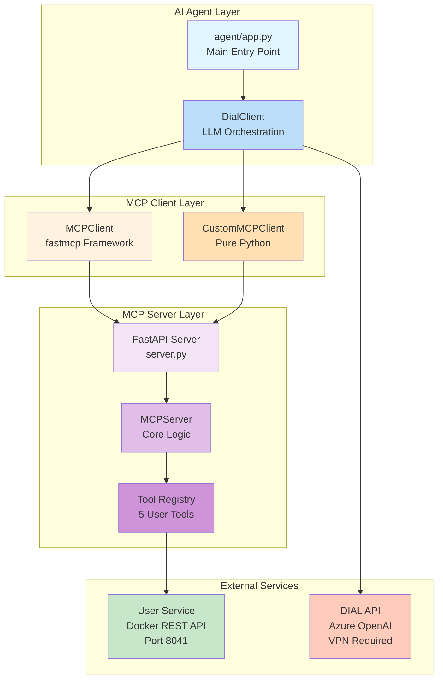
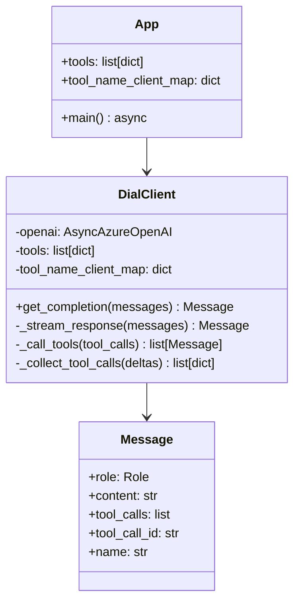
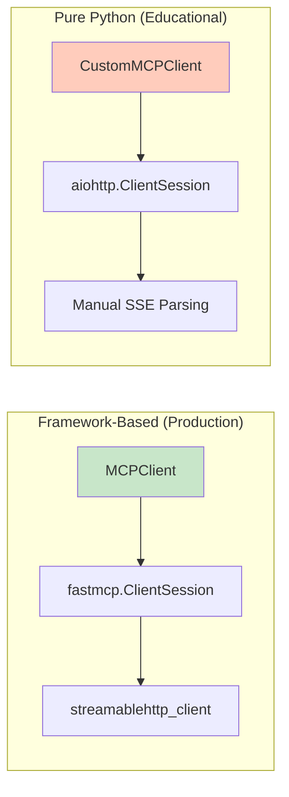
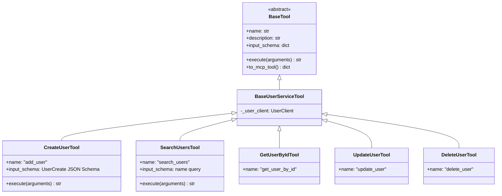
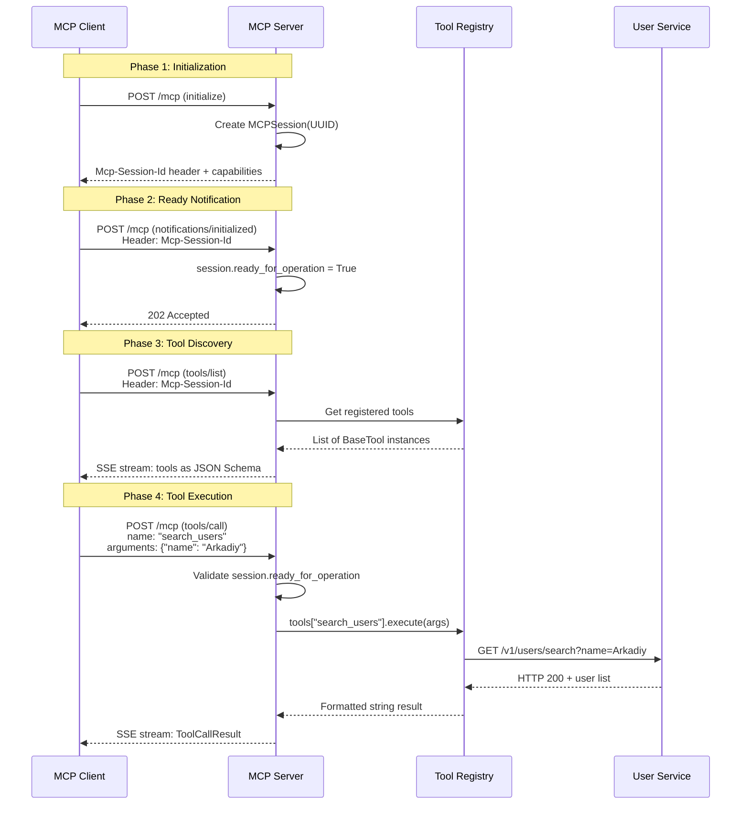
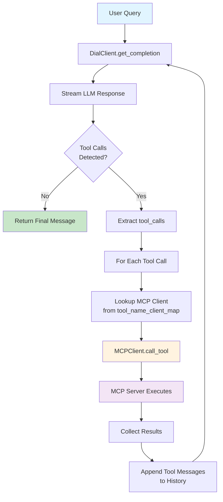
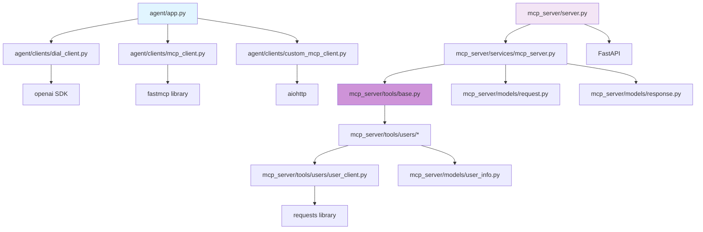

# System Architecture

## Table of Contents

- [High-Level Architecture](#high-level-architecture)
- [Component Overview](#component-overview)
- [Protocol Flow](#protocol-flow)
- [Session Lifecycle](#session-lifecycle)
- [Data Flow Patterns](#data-flow-patterns)
- [Module Structure](#module-structure)
- [Design Decisions](#design-decisions)
- [Constraints and Limitations](#constraints-and-limitations)

## High-Level Architecture



### Architecture Layers

| Layer | Responsibility | Technologies |
|-------|---------------|-------------|
| **AI Agent** | Orchestrate LLM interactions, manage message history, tool call routing | Azure OpenAI, Python asyncio |
| **MCP Client** | Protocol communication, session management, tool discovery/execution | fastmcp, aiohttp, JSON-RPC 2.0 |
| **MCP Server** | Tool registration, request handling, SSE streaming | FastAPI, Uvicorn, Pydantic |
| **External Services** | Data persistence (users), AI inference | Docker, REST APIs |

## Component Overview

### 1. AI Agent ([agent/](../agent/))

**Purpose**: High-level orchestration of AI-driven tool execution via MCP protocol.

#### Components



**Key Files**:
- [app.py](../agent/app.py) - Entry point, client initialization, console loop
- [dial_client.py](../agent/clients/dial_client.py) - Streaming LLM interactions, tool call routing
- [message.py](../agent/models/message.py) - Message envelope (system/user/assistant/tool roles)

**Responsibilities**:
- Aggregate tools from multiple MCP servers (local UMS + remote fetch)
- Stream AI responses token-by-token
- Detect tool calls in LLM responses
- Route tool execution to appropriate MCP client
- Maintain conversation history with tool results

### 2. MCP Client ([agent/clients/](../agent/clients/))

**Purpose**: Abstract MCP protocol communication for agent consumption.

#### Dual Implementation Strategy



**Key Files**:
- [mcp_client.py](../agent/clients/mcp_client.py) - Framework wrapper using `fastmcp` library
- [custom_mcp_client.py](../agent/clients/custom_mcp_client.py) - Pure Python with aiohttp (TODO: complete)

**MCPClient (Framework)**:
- Uses `fastmcp.ClientSession` for protocol abstraction
- Automatic SSE stream handling via `streamablehttp_client`
- Minimal boilerplate, focus on business logic

**CustomMCPClient (Educational)**:
- Direct HTTP/SSE implementation with aiohttp
- Explicit JSON-RPC envelope construction
- Manual SSE parsing (`data:` prefix, `[DONE]` marker)
- **Purpose**: Demonstrate protocol internals for learning

See [ADR-001](./adr/ADR-001-dual-client-implementation.md) for design rationale.

### 3. MCP Server ([mcp_server/](../mcp_server/))

**Purpose**: FastAPI-based JSON-RPC 2.0 server exposing user management tools via MCP protocol.

#### Server Architecture

```mermaid
graph TD
    subgraph "HTTP Layer"
        A[FastAPI App]
        B[/mcp POST Endpoint]
    end
    
    subgraph "Protocol Layer"
        C[MCPServer Service]
        D[Session Manager]
        E[Tool Registry]
    end
    
    subgraph "Tool Layer"
        F[BaseTool ABC]
        G[BaseUserServiceTool]
        H[5 Concrete Tools]
    end
    
    subgraph "Integration Layer"
        I[UserClient]
        J[REST API Adapter]
    end
    
    A --> B
    B --> C
    C --> D
    C --> E
    E --> F
    F --> G
    G --> H
    H --> I
    I --> J
    
    style A fill:#f3e5f5
    style C fill:#e1bee7
    style F fill:#ce93d8
    style I fill:#c8e6c9
```

**Key Files**:
- [server.py](../mcp_server/server.py) - FastAPI app, SSE streaming, header validation
- [mcp_server.py](../mcp_server/services/mcp_server.py) - Core MCP logic, session management, tool routing
- [base.py](../mcp_server/tools/base.py) - Abstract tool interface
- [user_client.py](../mcp_server/tools/users/user_client.py) - REST API wrapper

**Responsibilities**:
- Validate `Accept` header (must include `application/json` + `text/event-stream`)
- Generate UUID session IDs on `initialize`
- Enforce `notifications/initialized` before tool operations
- Stream responses as SSE with `[DONE]` markers
- Wrap tool exceptions in MCP error format

### 4. Tool System

**Purpose**: Extensible framework for defining MCP-compatible operations.

#### Tool Class Hierarchy



**Tool Registration Pattern**:
```python
# In MCPServer.__init__()
user_client = UserClient()
tools = [
    GetUserByIdTool(user_client),
    SearchUsersTool(user_client),
    CreateUserTool(user_client),
    UpdateUserTool(user_client),
    DeleteUserTool(user_client)
]
for tool in tools:
    self.tools[tool.name] = tool
```

**Design Benefits**:
- **Extensibility**: Add new tools by subclassing `BaseTool`
- **Validation**: Pydantic schemas auto-generate from `input_schema`
- **Testability**: Mock `UserClient` for unit tests
- **Discoverability**: `to_mcp_tool()` generates OpenAI-compatible schemas

## Protocol Flow

### MCP Session Lifecycle



### JSON-RPC Request/Response Structure

**Request (Client → Server)**:
```json
{
  "jsonrpc": "2.0",
  "id": 1,
  "method": "tools/call",
  "params": {
    "name": "add_user",
    "arguments": {
      "name": "Arkadiy",
      "surname": "Dobkin",
      "email": "arkadiy.dobkin@epam.com",
      "about_me": "Co-founder and CEO of EPAM Systems"
    }
  }
}
```

**Response (Server → Client, SSE format)**:
```
data: {"jsonrpc": "2.0", "id": 1, "result": {"content": [{"type": "text", "text": "User created..."}]}}
data: [DONE]
```

### Critical Session Rules

1. **Order Dependency**: Must call in sequence:
   - `initialize` → `notifications/initialized` → `tools/list`/`tools/call`
2. **Session ID Propagation**: Server returns `Mcp-Session-Id` header on `initialize`, client includes in all subsequent requests
3. **Ready Flag**: `session.ready_for_operation` only set to `True` after `notifications/initialized`
4. **Common Pitfall**: Forgetting notification step causes `400 Session Not Ready` errors

See [ADR-002](./adr/ADR-002-session-management-strategy.md) for session design decisions.

## Data Flow Patterns

### Agent Loop: Tool Execution Cycle



**Flow Description**:
1. User sends query → Agent receives as `Message(role=USER)`
2. `DialClient` streams LLM response → Detects `tool_calls` in response
3. For each tool call:
   - Lookup MCP client from `tool_name_client_map`
   - Execute tool via `MCPClient.call_tool(name, args)`
   - MCP server routes to registered tool → UserClient REST call
4. Collect results as `Message(role=TOOL)` → Append to history
5. Recursively call `get_completion()` with updated history → LLM sees tool results
6. Repeat until no more tool calls → Return final assistant message

### SSE Streaming Pipeline


**Implementation** ([server.py](../mcp_server/server.py)):
```python
async def _create_sse_stream(messages: list):
    for message in messages:
        event_data = f"data: {json.dumps(message.dict(exclude_none=True))}\n\n"
        yield event_data.encode('utf-8')
    yield b"data: [DONE]\n\n"  # Terminator
```

**Client Parsing** ([custom_mcp_client.py](../agent/clients/custom_mcp_client.py)):
```python
async for line in response.content:
    line_str = line.decode('utf-8').strip()
    if line_str.startswith('data: ') and line_str[6:] != '[DONE]':
        return json.loads(line_str[6:])
```

## Module Structure

### Project Layout

```
ai-dial-mcp-advanced/
├── agent/                      # MCP Client + AI Agent
│   ├── clients/
│   │   ├── mcp_client.py       # Framework-based (fastmcp)
│   │   ├── custom_mcp_client.py # Pure Python (TODO)
│   │   └── dial_client.py      # Azure OpenAI orchestration
│   ├── models/
│   │   └── message.py          # Role-based message envelopes
│   └── app.py                  # Entry point, console loop
│
├── mcp_server/                 # MCP Server + Tools
│   ├── models/
│   │   ├── request.py          # MCPRequest (JSON-RPC in)
│   │   ├── response.py         # MCPResponse (JSON-RPC out)
│   │   └── user_info.py        # Pydantic schemas (UserCreate, etc.)
│   ├── services/
│   │   └── mcp_server.py       # Core logic, session manager
│   ├── tools/
│   │   ├── base.py             # Abstract BaseTool
│   │   └── users/              # 5 user tools + REST client
│   └── server.py               # FastAPI endpoint
│
├── docs/                       # Documentation (this folder)
├── requirements.txt            # Python dependencies
├── docker-compose.yml          # User service container
└── mcp.postman_collection.json # API testing
```

### Module Dependencies



### Dependency Matrix

| Module | External Deps | Internal Deps | Purpose |
|--------|--------------|---------------|---------|
| `agent/app.py` | - | dial_client, mcp_client | Entry point, console loop |
| `dial_client.py` | openai | message.py, mcp_client | LLM streaming, tool routing |
| `mcp_client.py` | fastmcp, mcp | - | Framework MCP client |
| `custom_mcp_client.py` | aiohttp | - | Pure Python MCP client |
| `mcp_server/server.py` | FastAPI, uvicorn | mcp_server, request/response | HTTP endpoint, SSE |
| `mcp_server.py` | - | tools/*, request/response | Session mgmt, tool registry |
| `tools/base.py` | - | - | Abstract tool interface |
| `tools/users/*` | - | base, user_client, user_info | Concrete tool implementations |
| `user_client.py` | requests | user_info | REST API wrapper |

## Design Decisions

### 1. Synchronous REST Client in Async Context

**Decision**: [user_client.py](../mcp_server/tools/users/user_client.py) uses `requests` (blocking) despite async `execute()` signature.

**Rationale**:
- **Learning Focus**: Simplifies code for educational purposes
- **External Service**: User service is I/O-bound but synchronous
- **Performance**: Blocking acceptable for demo workload (1-2 tool calls per agent loop)

**Trade-off**:
- Blocks event loop during HTTP calls
- Not suitable for high-concurrency production
- **Future**: Could replace with `aiohttp` or `httpx` for async I/O

**Status**: Accepted for learning project scope

### 2. Dual Client Implementation

**Decision**: Maintain both `MCPClient` (framework) and `CustomMCPClient` (pure Python).

**Rationale**: See [ADR-001](./adr/ADR-001-dual-client-implementation.md)

**Summary**:
- Framework version for production use (less boilerplate)
- Pure Python version for protocol education (explicit SSE parsing)
- Both implement same interface (interchangeable in agent)

### 3. Single Endpoint Design

**Decision**: All MCP methods (`initialize`, `tools/list`, `tools/call`) handled by one `/mcp` POST endpoint.

**Rationale**:
- **Protocol Compliance**: MCP spec expects single JSON-RPC endpoint
- **Flexibility**: Method routing via `request.method` field
- **Session Continuity**: All requests share same session ID header

**Alternative Considered**: Separate endpoints (`/initialize`, `/tools/list`) rejected due to protocol mismatch.

### 4. String-Based Tool Results

**Decision**: Tools return formatted strings (not dicts) wrapped in `ContentItem(type="text", text=result)`.

**Rationale**:
- **LLM Consumption**: AI models process text more reliably than structured JSON
- **Readability**: Markdown code blocks improve formatting in streaming responses
- **MCP Spec**: ContentItem supports multiple types (text, image); text is universal

**Example** ([user_client.py](../mcp_server/tools/users/user_client.py)):
```python
def __user_to_string(self, user: dict[str, Any]):
    user_str = "```\n"
    for key, value in user.items():
        user_str += f"  {key}: {value}\n"
    user_str += "```\n"
    return user_str
```

## Constraints and Limitations

### Technical Constraints

1. **Python 3.11+ Required**
   - Uses `dict[str, Any]` syntax (not `Dict[str, Any]`)
   - Async/await patterns throughout
   - **Impact**: Cannot run on Python 3.9 or earlier

2. **EPAM VPN Dependency**
   - DIAL API only accessible via corporate VPN
   - **Impact**: External users cannot test AI agent features
   - **Workaround**: Mock DIAL responses or use public OpenAI API

3. **Docker Dependency**
   - User service runs in container (port 8041)
   - **Impact**: Requires Docker Desktop or Docker CLI
   - **Workaround**: Could implement in-memory user store

4. **Single-Threaded Server**
   - Uvicorn runs single worker by default
   - Blocking `requests` calls in UserClient
   - **Impact**: Low concurrency ceiling (~10 req/sec)

### Protocol Limitations

1. **No Session Persistence**
   - Sessions stored in memory (lost on server restart)
   - No expiration or cleanup logic
   - **Impact**: Memory leak potential in long-running deployments

2. **No Authentication**
   - Session ID only security mechanism
   - No API keys or OAuth
   - **Impact**: Unsuitable for public deployment

3. **Error Recovery**
   - Tool failures return as MCP errors (no retries)
   - Network timeouts not handled gracefully
   - **Impact**: Client must implement retry logic

### Scope Limitations (Learning Project)

1. **No Persistent Storage**: Users reset on Docker restart
2. **No Observability**: No structured logging or metrics
3. **No CI/CD**: Manual testing only (Postman collection)
4. **No Security**: Accepts all requests (no rate limiting)

### Open Design Questions

- **TODO**: Should session IDs expire after inactivity?
- **TODO**: How to handle concurrent tool executions (parallel calls)?
- **TODO**: Should tool results support streaming (partial results)?
- **TODO**: Error code standardization (map HTTP 404 → MCP error codes)?

---

**Next**: Review [API Reference](./api.md) for detailed endpoint specifications and tool schemas.
