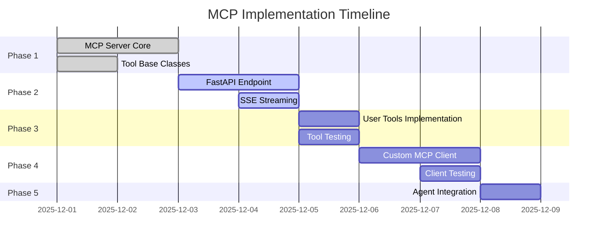

# Project Roadmap

## Table of Contents

- [Overview](#overview)
- [Current Status](#current-status)
- [Implementation Phases](#implementation-phases)
- [Task Breakdown](#task-breakdown)
- [Risk Register](#risk-register)
- [Future Enhancements](#future-enhancements)

## Overview

This roadmap outlines the learning journey for completing the MCP server/client implementation. Tasks are organized by phase with estimated effort and dependencies.

### Learning Objectives

1. **Phase 1**: Implement MCP server core and tool registration
2. **Phase 2**: Complete FastAPI endpoints with SSE streaming
3. **Phase 3**: Implement and test user management tools
4. **Phase 4**: Build pure Python MCP client (educational)
5. **Phase 5**: End-to-end agent testing and validation

### Estimated Timeline

| Phase | Duration | Difficulty | Dependencies |
|-------|----------|------------|--------------|
| Phase 1 | 2-3 hours | Medium | Python async knowledge |
| Phase 2 | 2-3 hours | Medium | FastAPI basics |
| Phase 3 | 1-2 hours | Easy | Phase 1 complete |
| Phase 4 | 3-4 hours | Hard | HTTP/SSE understanding |
| Phase 5 | 1 hour | Easy | All phases complete |

**Total Estimated Effort**: 9-13 hours

## Current Status

### Implementation Progress

### Completion Metrics

**Overall**: 45% complete

| Component | Status | Completion |
|-----------|--------|------------|
| MCP Protocol Models | ✅ Complete | 100% |
| Tool Base Classes | ✅ Complete | 100% |
| User Service Client | ✅ Complete | 100% |
| MCPClient (framework) | ✅ Complete | 100% |
| DialClient | ✅ Complete | 100% |
| MCPServer Core | 🚧 In Progress | 60% |
| FastAPI Server | 🚧 In Progress | 50% |
| User Tools | 🚧 In Progress | 40% |
| CustomMCPClient | ❌ Not Started | 0% |
| End-to-End Testing | ❌ Not Started | 0% |

## Implementation Phases

### Phase 1: MCP Server Core ⏳

**Objective**: Implement core MCP protocol logic for session management and tool routing.

**File**: [mcp_server/services/mcp_server.py](../mcp_server/services/mcp_server.py)

#### Tasks

- [x] Define `MCPSession` class with ready flag (✅ Complete)
- [x] Implement `_register_tools()` method (✅ Complete)
- [ ] Complete `handle_initialize()` method (🚧 TODO)
  - Create session with UUID
  - Return server info and capabilities
  - Set protocol version
- [ ] Complete `handle_notifications_initialized()` method (🚧 TODO)
  - Validate session exists
  - Set `ready_for_operation = True`
- [ ] Complete `handle_tools_list()` method (🚧 TODO)
  - Validate session ready
  - Convert tools to MCP format via `to_mcp_tool()`
  - Return tools list
- [ ] Complete `handle_tools_call()` method (🚧 TODO)
  - Validate session ready
  - Lookup tool in registry
  - Validate arguments against schema
  - Execute tool
  - Wrap result in `ToolCallResult`
  - Handle exceptions (set `isError: true`)

**Estimated Effort**: 2-3 hours

**Learning Focus**:
- Session state management
- Pydantic model validation
- Async error handling

---

### Phase 2: FastAPI Endpoint Implementation ⏳

**Objective**: Complete HTTP server with SSE streaming and header validation.

**File**: [mcp_server/server.py](../mcp_server/server.py)

#### Tasks

- [x] Implement `_validate_accept_header()` helper (✅ Complete)
- [x] Implement `_create_sse_stream()` helper (✅ Complete)
- [ ] Complete `handle_mcp_request()` endpoint (🚧 TODO)
  - Route to `initialize` handler (no session validation)
  - Route to `notifications/initialized` handler (check session ID)
  - Route to `tools/list` handler (check session ready)
  - Route to `tools/call` handler (check session ready)
  - Set `Mcp-Session-Id` response header
  - Return SSE stream via `StreamingResponse`
  - Handle unknown methods (return -32601 error)

**Estimated Effort**: 2-3 hours

**Learning Focus**:
- FastAPI routing patterns
- StreamingResponse usage
- HTTP header manipulation

**Dependencies**: Phase 1 (70% complete)

---

### Phase 3: User Management Tools 🔵

**Objective**: Implement CRUD operations for user tools using existing UserClient.

**Files**:
- [create_user_tool.py](../mcp_server/tools/users/create_user_tool.py)
- [update_user_tool.py](../mcp_server/tools/users/update_user_tool.py)
- [delete_user_tool.py](../mcp_server/tools/users/delete_user_tool.py)
- [get_user_by_id_tool.py](../mcp_server/tools/users/get_user_by_id_tool.py)
- [search_users_tool.py](../mcp_server/tools/users/search_users_tool.py)

#### Tasks

**All Tools** (repeat for each):
- [ ] Define `name` property (e.g., `"add_user"`)
- [ ] Define `description` property (clear, actionable)
- [ ] Define `input_schema` property
  - Use Pydantic `model_json_schema()` for complex types
  - Manually define for simple schemas
- [ ] Implement `execute()` method
  - Validate arguments with Pydantic
  - Call `self._user_client.<method>()`
  - Catch exceptions and return error strings
  - Return formatted string result

**Tool-Specific Notes**:

**CreateUserTool**:
- Input: `UserCreate` schema (name, surname, email, about_me required)
- Output: "User created with ID: {id}\n{user details}"

**SearchUsersTool**:
- Input: `{"name": str}` (simple schema)
- Output: Concatenated user blocks or "No users found"

**GetUserByIdTool**:
- Input: `{"id": int}`
- Output: Single user block or "User not found"

**UpdateUserTool**:
- Input: `{"id": int}` + `UserUpdate` fields
- Output: "User {id} updated successfully\n{updated user}"

**DeleteUserTool**:
- Input: `{"id": int}`
- Output: "User {id} deleted successfully"

**Estimated Effort**: 1-2 hours (20-30 min per tool)

**Learning Focus**:
- Pydantic schema generation
- Error handling patterns
- String formatting for LLM consumption

**Dependencies**: Phase 1 and 2 (80% complete)

---

### Phase 4: Pure Python MCP Client 🔴

**Objective**: Implement CustomMCPClient from scratch to understand protocol internals.

**File**: [agent/clients/custom_mcp_client.py](../agent/clients/custom_mcp_client.py)

#### Tasks

- [ ] Implement `connect()` method (🚧 TODO)
  - Create aiohttp.ClientSession
  - Send `initialize` request
  - Capture `Mcp-Session-Id` from response header
  - Send `notifications/initialized` notification
  - Print connection confirmation
- [ ] Implement `_send_request()` method (🚧 TODO)
  - Construct JSON-RPC request with unique ID
  - Add `Mcp-Session-Id` header if available
  - POST to server endpoint
  - Determine response format (JSON vs SSE)
  - Parse response via `_parse_sse_response_streaming()`
  - Check for JSON-RPC error field
- [ ] Implement `_parse_sse_response_streaming()` method (🚧 TODO)
  - Stream response line-by-line
  - Skip empty lines and comments
  - Extract JSON from `data: ` prefixed lines
  - Stop at `[DONE]` marker
- [ ] Implement `_send_notification()` method (🚧 TODO)
  - Omit `id` field (notification pattern)
  - POST to server
  - Handle 202 Accepted response
- [ ] Implement `get_tools()` method (🚧 TODO)
  - Send `tools/list` request
  - Parse response and extract tools array
  - Transform to OpenAI format
- [ ] Implement `call_tool()` method (🚧 TODO)
  - Send `tools/call` request with name and arguments
  - Parse response and extract `content[0].text`
  - Return result string

**Estimated Effort**: 3-4 hours

**Learning Focus**:
- HTTP streaming with aiohttp
- SSE parsing (line-by-line, markers)
- JSON-RPC envelope construction
- Async context managers

**Dependencies**: Phase 1, 2, 3 (90% complete)

**Validation**: Test agent with `CustomMCPClient` instead of `MCPClient` (swap in app.py)

---

### Phase 5: End-to-End Testing 🔵

**Objective**: Validate full stack with complex agent queries.

#### Tasks

- [ ] Test with MCPClient (framework)
  - Run agent with query: "Check if Arkadiy Dobkin present as a user, if not then add him"
  - Verify tool call sequence (search → add)
  - Confirm user created and retrievable
- [ ] Test with CustomMCPClient (pure Python)
  - Swap client in app.py: `CustomMCPClient.create(...)`
  - Repeat same query
  - Verify identical behavior
- [ ] Test error scenarios
  - Invalid tool name
  - Missing required arguments
  - User not found (404)
- [ ] Test concurrent sessions (Postman)
  - Open two Postman tabs with different session IDs
  - Execute tools in parallel
  - Verify no session interference
- [ ] Performance testing (optional)
  - Measure latency per tool call
  - Test with 10 concurrent requests
  - Identify bottlenecks (blocking `requests` calls)

**Estimated Effort**: 1 hour

**Learning Focus**:
- Agent orchestration patterns
- Error propagation across layers
- Session isolation

**Dependencies**: All previous phases (100% complete)

---

## Task Breakdown

### Detailed TODO Locations

**High Priority** (blocks progress):

1. **MCPServer.handle_initialize()** ([mcp_server.py:150-180](../mcp_server/services/mcp_server.py#L150-L180))
   - Lines: ~30
   - Complexity: Medium
   - Hints: Follow TODO comments in code

2. **MCPServer.handle_tools_call()** ([mcp_server.py:220-260](../mcp_server/services/mcp_server.py#L220-L260))
   - Lines: ~40
   - Complexity: Hard (schema validation, error handling)
   - Hints: Use Pydantic `model_validate()`, wrap exceptions

3. **FastAPI handle_mcp_request()** ([server.py:80-150](../mcp_server/server.py#L80-L150))
   - Lines: ~70
   - Complexity: Medium
   - Hints: Route based on `request.method`, check session state

**Medium Priority** (enables testing):

4. **User Tools (5 files)** ([tools/users/*.py](../mcp_server/tools/users/))
   - Lines per tool: ~30-50
   - Complexity: Easy
   - Hints: Copy pattern from one tool to others

5. **CustomMCPClient.connect()** ([custom_mcp_client.py:120-160](../agent/clients/custom_mcp_client.py#L120-L160))
   - Lines: ~40
   - Complexity: Hard (SSE parsing, session lifecycle)
   - Hints: Follow framework client pattern

**Low Priority** (optional enhancements):

6. Unit tests (new files in `tests/`)
7. Web search tool integration (remote MCP server)
8. Observability (structured logging, metrics)

---

## Risk Register

| Risk | Probability | Impact | Mitigation |
|------|------------|--------|------------|
| **Blocking requests in UserClient** | High | Medium | Acceptable for learning scope; document limitation |
| **SSE parsing errors in CustomMCPClient** | Medium | High | Extensive manual testing with Postman; add debug prints |
| **Session ID collisions (UUID)** | Low | High | Use `uuid.uuid4()` (cryptographically random) |
| **DIAL API rate limiting** | Medium | Medium | Cache responses; use local mock LLM for dev |
| **Docker container crashes** | Low | Medium | Docker Compose restart policy; health checks |
| **Python version incompatibility** | Low | High | Document Python 3.11+ requirement; CI checks |
| **VPN connectivity issues** | High | Medium | Provide fallback instructions for external users |
| **Incomplete TODO implementations** | Medium | High | Detailed inline comments with step-by-step guidance |

---

## Future Enhancements

### Short-Term (Post-Learning)

1. **Async HTTP Client**
   - Replace `requests` with `aiohttp` or `httpx` in UserClient
   - Benefit: Non-blocking I/O for higher concurrency
   - Effort: 1-2 hours

2. **Session Persistence**
   - Store sessions in Redis or SQLite
   - Add expiration logic (TTL)
   - Benefit: Survive server restarts
   - Effort: 2-3 hours

3. **Structured Logging**
   - Replace print statements with `logging` module
   - Add correlation IDs for request tracing
   - Benefit: Production-ready observability
   - Effort: 1 hour

4. **Unit Test Coverage**
   - pytest for all tools and clients
   - Mock external dependencies (UserClient, DIAL API)
   - Target: 80% code coverage
   - Effort: 4-6 hours

### Medium-Term (Feature Additions)

5. **Remote MCP Server Integration**
   - Add web search tool from `https://remote.mcpservers.org/fetch/mcp`
   - Aggregate tools from multiple servers in agent
   - Update test query to use web search
   - Effort: 2-3 hours

6. **Authentication & Authorization**
   - API key validation for MCP server
   - Rate limiting per client
   - Benefit: Production readiness
   - Effort: 3-4 hours

7. **OpenAPI Documentation**
   - FastAPI auto-generates Swagger UI at `/docs`
   - Add descriptions and examples
   - Benefit: Self-documenting API
   - Effort: 1 hour

8. **Error Recovery**
   - Retry logic in MCPClient
   - Circuit breaker for user service
   - Graceful degradation
   - Effort: 2-3 hours

### Long-Term (Architecture Evolution)

9. **Multi-Worker Deployment**
   - Run Uvicorn with multiple workers
   - Shared session store (Redis)
   - Load balancer (Nginx)
   - Benefit: Horizontal scaling
   - Effort: 1-2 days

10. **Observability Stack**
    - Prometheus metrics
    - Grafana dashboards
    - OpenTelemetry tracing
    - Effort: 2-3 days

11. **CI/CD Pipeline**
    - GitHub Actions or GitLab CI
    - Automated testing on PR
    - Docker image building
    - Effort: 1 day

12. **MCP Client Library**
    - Extract CustomMCPClient as reusable package
    - Publish to PyPI
    - Documentation and examples
    - Effort: 3-4 days

---

## Success Criteria

### Phase Completion Checklist

**Phase 1: MCP Server Core**
- [ ] All `handle_*` methods implemented
- [ ] Session lifecycle works (initialize → notify → operate)
- [ ] Tools registered in registry
- [ ] Postman `init` and `init-notification` requests succeed

**Phase 2: FastAPI Endpoint**
- [ ] All JSON-RPC methods routed correctly
- [ ] SSE streaming works (validated with curl -N)
- [ ] Header validation enforced (406 on missing Accept types)
- [ ] Postman `tools/list` request succeeds

**Phase 3: User Tools**
- [ ] All 5 tools implemented and tested
- [ ] Postman `tools/call` succeeds for each tool
- [ ] Error cases handled (404, validation errors)
- [ ] Tool results formatted as markdown

**Phase 4: CustomMCPClient**
- [ ] All protocol methods implemented
- [ ] Agent runs with CustomMCPClient (swap in app.py)
- [ ] Behavior identical to MCPClient
- [ ] SSE parsing robust (handles edge cases)

**Phase 5: E2E Testing**
- [ ] Agent completes complex query (search + add user)
- [ ] Error scenarios validated
- [ ] Concurrent sessions tested
- [ ] Documentation complete

### Project Completion

**Minimum Viable Product** (Learning Goals Met):
- ✅ MCP server exposes 5 user tools
- ✅ Framework client (MCPClient) operational
- ✅ Pure Python client (CustomMCPClient) operational
- ✅ AI agent orchestrates tool calls
- ✅ Postman collection validates protocol

**Stretch Goals** (Optional):
- ⬜ Remote MCP server integrated (web search)
- ⬜ Unit test coverage > 50%
- ⬜ Async UserClient (non-blocking I/O)
- ⬜ Session persistence (Redis)

---

**Next Actions**:
1. Start Phase 1: Complete MCPServer core methods
2. Test with Postman after each method implementation
3. Proceed to Phase 2 once `init` + `init-notification` work
4. Document learnings and gotchas in comments

See [Architecture](./architecture.md) for design context and [API Reference](./api.md) for endpoint specifications.
