# Testing Guide

## Table of Contents

- [Testing Strategy](#testing-strategy)
- [Postman Collection](#postman-collection)
- [Manual Testing Procedures](#manual-testing-procedures)
- [Validation Checklist](#validation-checklist)
- [Debugging Techniques](#debugging-techniques)
- [Test Scenarios](#test-scenarios)

## Testing Strategy

### Testing Pyramid

```mermaid
graph TD
    A[End-to-End Tests<br/>Agent Queries]
    B[Integration Tests<br/>MCP Client ↔ Server]
    C[Unit Tests<br/>Tool Execution]
    D[Protocol Tests<br/>JSON-RPC Compliance]
    
    A --> B --> C --> D
    
    style A fill:#e1f5ff
    style B fill:#fff3e0
    style C fill:#f3e5f5
    style D fill:#c8e6c9
```



### Test Levels

| Level | Scope | Tools | Status |
|-------|-------|-------|--------|
| **Protocol** | JSON-RPC 2.0 structure, SSE format | Postman | ✅ Manual |
| **Unit** | Individual tool execution, UserClient | pytest (TODO) | 🚧 Not Implemented |
| **Integration** | MCP Client ↔ Server communication | Postman, Python scripts | ✅ Manual |
| **End-to-End** | AI Agent with tool execution | Console queries | ✅ Manual |

**Current Focus**: Manual integration testing via Postman and console agent queries.

## Postman Collection

### Import Collection

1. Open Postman Desktop or Web
2. File → Import → Upload [mcp.postman_collection.json](../mcp.postman_collection.json)
3. Collection "mcp" appears in sidebar with 4 requests

### Collection Structure

```
mcp/
├── init                        # Initialize session
├── init-notification           # Mark session ready
├── tools/list                  # Discover available tools
└── tools/call                  # Execute specific tool
```

### Environment Setup

Create Postman environment "MCP Local":

| Variable | Initial Value | Current Value |
|----------|--------------|---------------|
| `BASE_URL` | `http://localhost:8006` | - |
| `SESSION_ID` | `<leave empty>` | `<captured from init>` |

**Usage**: Select "MCP Local" environment dropdown (top right).

## Manual Testing Procedures

### 1. Session Initialization Flow

**Test Objective**: Verify MCP session lifecycle (initialize → notify → operate).

#### Step 1: Initialize

**Request**: `init`

```http
POST http://localhost:8006/mcp HTTP/1.1
Content-Type: application/json
Accept: application/json, text/event-stream

{
  "jsonrpc": "2.0",
  "id": 1,
  "method": "initialize",
  "params": {
    "protocolVersion": "2024-11-05",
    "capabilities": {"tools": {}},
    "clientInfo": {"name": "test-client", "version": "1.0.0"}
  }
}
```

**Expected Response**:
- **Status**: 200 OK
- **Headers**: `Mcp-Session-Id: <uuid>`
- **Body** (SSE):
  ```
  data: {"jsonrpc": "2.0", "id": 1, "result": {"protocolVersion": "2024-11-05", ...}}
  data: [DONE]
  ```

**Validation**:
- [ ] Response includes `Mcp-Session-Id` header
- [ ] Session ID is valid UUID format
- [ ] `result.serverInfo.name` = `"custom-ums-mcp-server"`
- [ ] SSE stream ends with `[DONE]`

**Capture Session ID**: Copy from response headers → Paste into `init-notification` request header.

---

#### Step 2: Notify Ready

**Request**: `init-notification`

```http
POST http://localhost:8006/mcp HTTP/1.1
Content-Type: application/json
Accept: application/json, text/event-stream
Mcp-Session-Id: <paste-session-id-here>

{
  "jsonrpc": "2.0",
  "method": "notifications/initialized"
}
```

**Expected Response**:
- **Status**: 202 Accepted
- **Body**: Empty (no SSE stream for notifications)

**Validation**:
- [ ] HTTP 202 status
- [ ] No response body
- [ ] Server logs show "Session <id> marked ready"

---

#### Step 3: Discover Tools

**Request**: `tools/list`

```http
POST http://localhost:8006/mcp HTTP/1.1
Content-Type: application/json
Accept: application/json, text/event-stream
Mcp-Session-Id: <same-session-id>

{
  "jsonrpc": "2.0",
  "id": 2,
  "method": "tools/list"
}
```

**Expected Response**:
```json
{
  "jsonrpc": "2.0",
  "id": 2,
  "result": {
    "tools": [
      {
        "name": "get_user_by_id",
        "description": "Retrieve a user by their unique ID",
        "inputSchema": {...}
      },
      {
        "name": "search_users",
        "description": "Search users by name pattern",
        "inputSchema": {...}
      },
      {
        "name": "add_user",
        "description": "Create a new user",
        "inputSchema": {...}
      },
      {
        "name": "update_user",
        "description": "Update existing user",
        "inputSchema": {...}
      },
      {
        "name": "delete_user",
        "description": "Delete user by ID",
        "inputSchema": {...}
      }
    ]
  }
}
```

**Validation**:
- [ ] Exactly 5 tools returned
- [ ] Each tool has `name`, `description`, `inputSchema`
- [ ] `inputSchema` is valid JSON Schema (type: object)
- [ ] Tool names match expected: `get_user_by_id`, `search_users`, etc.

---

#### Step 4: Execute Tool

**Request**: `tools/call`

```http
POST http://localhost:8006/mcp HTTP/1.1
Content-Type: application/json
Accept: application/json, text/event-stream
Mcp-Session-Id: <same-session-id>

{
  "jsonrpc": "2.0",
  "id": 3,
  "method": "tools/call",
  "params": {
    "name": "search_users",
    "arguments": {
      "name": "John"
    }
  }
}
```

**Expected Response**:
```json
{
  "jsonrpc": "2.0",
  "id": 3,
  "result": {
    "content": [
      {
        "type": "text",
        "text": "```\n  id: 123\n  name: John\n  surname: Doe\n  ...\n```\n"
      }
    ]
  }
}
```

**Validation**:
- [ ] `result.content` is array with at least one item
- [ ] `content[0].type` = `"text"`
- [ ] `content[0].text` contains user data in markdown format
- [ ] No `isError` field (or `isError: null`)

---

### 2. Error Scenarios

#### Missing Accept Header

**Request**: Same as `init` but **remove** `Accept` header.

**Expected**: 406 Not Acceptable

**Validation**:
- [ ] HTTP 406 status
- [ ] Error message mentions missing Accept types

---

#### Missing Session ID

**Request**: `tools/list` without `Mcp-Session-Id` header.

**Expected**: 400 Bad Request

**Validation**:
- [ ] HTTP 400 status
- [ ] Error message: "Session ID required for this operation"

---

#### Session Not Ready

**Request**: `tools/list` immediately after `init` (skip `init-notification`).

**Expected**: 400 Bad Request

**Validation**:
- [ ] HTTP 400 status
- [ ] Error message: "Session not ready. Send notifications/initialized first"

---

#### Invalid Tool Name

**Request**: `tools/call` with `name: "nonexistent_tool"`.

**Expected**:
```json
{
  "jsonrpc": "2.0",
  "id": 3,
  "error": {
    "code": -32601,
    "message": "Method not found"
  }
}
```

**Validation**:
- [ ] Response contains `error` field (not `result`)
- [ ] Error code -32601 (method not found)

---

#### Invalid Arguments

**Request**: `tools/call` with `name: "get_user_by_id"`, `arguments: {}` (missing required `id`).

**Expected**:
```json
{
  "jsonrpc": "2.0",
  "id": 3,
  "error": {
    "code": -32602,
    "message": "Invalid params"
  }
}
```

**Validation**:
- [ ] Error code -32602 (invalid params)

---

### 3. Tool Execution Tests

#### get_user_by_id

**Test Case**: Retrieve existing user

```json
{
  "name": "get_user_by_id",
  "arguments": {"id": 1}
}
```

**Expected**: User details with ID 1

**Validation**:
- [ ] `content[0].text` contains `id: 1`
- [ ] Includes `name`, `surname`, `email`, etc.

---

**Test Case**: Non-existent user

```json
{
  "name": "get_user_by_id",
  "arguments": {"id": 99999}
}
```

**Expected**:
```json
{
  "result": {
    "content": [{"type": "text", "text": "HTTP 404: ..."}],
    "isError": true
  }
}
```

**Validation**:
- [ ] `isError: true`
- [ ] Text mentions "404" or "not found"

---

#### search_users

**Test Case**: Search existing name

```json
{
  "name": "search_users",
  "arguments": {"name": "John"}
}
```

**Expected**: List of users matching "John"

**Validation**:
- [ ] Multiple users returned (formatted as markdown)
- [ ] Each user block starts with triple backticks

---

**Test Case**: No matches

```json
{
  "name": "search_users",
  "arguments": {"name": "Zzzzzzz"}
}
```

**Expected**: Empty result or "No users found" message

---

#### add_user

**Test Case**: Create valid user

```json
{
  "name": "add_user",
  "arguments": {
    "name": "Arkadiy",
    "surname": "Dobkin",
    "email": "arkadiy.dobkin@epam.com",
    "about_me": "Co-founder of EPAM Systems"
  }
}
```

**Expected**:
```
User created with ID: <new_id>
```

**Validation**:
- [ ] Response includes assigned user ID
- [ ] Can retrieve user with `get_user_by_id` using new ID

---

**Test Case**: Missing required fields

```json
{
  "name": "add_user",
  "arguments": {
    "name": "John"
    // Missing surname, email, about_me
  }
}
```

**Expected**: Validation error (`isError: true`)

---

#### update_user

**Test Case**: Update existing user

```json
{
  "name": "update_user",
  "arguments": {
    "id": 1,
    "company": "EPAM Systems",
    "salary": 120000.0
  }
}
```

**Expected**: Confirmation of update

**Validation**:
- [ ] Retrieve user with `get_user_by_id` → Verify fields updated

---

#### delete_user

**Test Case**: Delete existing user

```json
{
  "name": "delete_user",
  "arguments": {"id": 1}
}
```

**Expected**: Deletion confirmation

**Validation**:
- [ ] Subsequent `get_user_by_id` with same ID returns 404 error

---

## Validation Checklist

### Protocol Compliance

- [ ] All responses include `jsonrpc: "2.0"` field
- [ ] Request `id` echoed in response `id`
- [ ] SSE format: `data: {...}\n\n` followed by `data: [DONE]\n\n`
- [ ] Notifications have no `id` field
- [ ] Errors use `error` field (not `result`)

### Session Management

- [ ] `Mcp-Session-Id` generated on `initialize`
- [ ] Session ID is valid UUID v4
- [ ] Session ID returned in all subsequent responses
- [ ] Operations blocked before `notifications/initialized`
- [ ] Session persists across multiple requests

### Tool Discovery

- [ ] `tools/list` returns all 5 user tools
- [ ] Each tool schema includes `type: "object"` in `inputSchema`
- [ ] Required fields listed in `inputSchema.required` array
- [ ] Descriptions are clear and actionable

### Tool Execution

- [ ] Successful executions return `result.content` array
- [ ] Failed executions set `isError: true`
- [ ] Tool results formatted as markdown (triple backticks)
- [ ] Arguments validated against `inputSchema`

### Error Handling

- [ ] Invalid JSON → Parse error (-32700)
- [ ] Missing method → Method not found (-32601)
- [ ] Invalid params → Invalid params (-32602)
- [ ] HTTP errors mapped to MCP error format

## Debugging Techniques

### 1. Server-Side Logging

Add debug prints in [server.py](../mcp_server/server.py):

```python
@app.post("/mcp")
async def handle_mcp_request(request: MCPRequest, ...):
    print(f"[DEBUG] Method: {request.method}")
    print(f"[DEBUG] Params: {request.params}")
    print(f"[DEBUG] Session ID: {mcp_session_id}")
    
    # ... existing code
```

### 2. SSE Stream Inspection

**Postman**: View raw response body (switch to "Raw" tab).

**curl**:
```bash
curl -N -X POST http://localhost:8006/mcp \
  -H "Content-Type: application/json" \
  -H "Accept: application/json, text/event-stream" \
  -H "Mcp-Session-Id: <session-id>" \
  -d '{"jsonrpc": "2.0", "id": 1, "method": "tools/list"}'
```

### 3. Network Traffic Capture

**Chrome DevTools** (if using REST Client extension):
1. Open DevTools → Network tab
2. Send request
3. Inspect request/response headers and body

**Wireshark** (advanced):
```bash
tshark -i lo0 -f "tcp port 8006" -Y http
```

### 4. Docker Container Logs

```bash
# Real-time logs
docker-compose logs -f userservice

# Filter HTTP errors
docker-compose logs userservice | grep "status\": 40"

# Search for specific user ID
docker-compose logs userservice | grep "user_id=123"
```

### 5. Python Debugger

**VS Code**: Set breakpoints in [mcp_server.py](../mcp_server/services/mcp_server.py), press F5.

**CLI**:
```bash
python -m pdb mcp_server/server.py
# (Pdb) b mcp_server/services/mcp_server.py:150  # Set breakpoint
# (Pdb) c  # Continue
```

## Test Scenarios

### Scenario 1: First-Time User Onboarding

**Objective**: Simulate new client connecting to MCP server.

**Steps**:
1. Start MCP server and User Service
2. Execute `init` → Capture session ID
3. Execute `init-notification`
4. Execute `tools/list` → Verify 5 tools
5. Execute `tools/call` with `search_users` → Verify results
6. Execute `tools/call` with `add_user` → Create new user
7. Execute `tools/call` with `get_user_by_id` → Verify creation

**Pass Criteria**: All steps complete without errors, new user retrievable.

---

### Scenario 2: Error Recovery

**Objective**: Test client resilience to invalid requests.

**Steps**:
1. Send `tools/list` without session ID → Expect 400
2. Correct by adding session ID → Expect success
3. Send `tools/call` with invalid tool name → Expect -32601 error
4. Correct tool name but invalid arguments → Expect -32602 error
5. Send valid request → Expect success

**Pass Criteria**: Client recovers from all errors and completes valid request.

---

### Scenario 3: Agent Integration (End-to-End)

**Objective**: Test AI agent with MCP tools.

**Prerequisites**: DIAL API key set, VPN connected.

**Steps**:
1. Start full stack (User Service, MCP Server, AI Agent)
2. Enter query: "Check if Arkadiy Dobkin present as a user, if not then add him"
3. Observe agent behavior:
   - Calls `search_users` tool
   - Detects no results
   - Calls `add_user` tool with inferred information
   - Returns confirmation message

**Pass Criteria**: Agent successfully adds user without manual intervention.

---

### Scenario 4: Concurrent Sessions

**Objective**: Test multi-client session isolation.

**Steps**:
1. Open two Postman tabs
2. Tab 1: Initialize → Capture session ID A
3. Tab 2: Initialize → Capture session ID B
4. Tab 1: Call `add_user` with name "Alice"
5. Tab 2: Call `add_user` with name "Bob"
6. Verify both users created with different IDs

**Pass Criteria**: Sessions do not interfere; both users created successfully.

---

## Automated Testing (TODO)

### Unit Test Framework

**Setup** (not yet implemented):

```bash
pip install pytest pytest-asyncio pytest-mock
```

**Example Test** ([tests/test_tools.py](../tests/test_tools.py) - TODO):

```python
import pytest
from mcp_server.tools.users.search_users_tool import SearchUsersTool
from mcp_server.tools.users.user_client import UserClient

@pytest.mark.asyncio
async def test_search_users_success(mocker):
    # Mock UserClient
    mock_client = mocker.Mock(spec=UserClient)
    mock_client.search_users.return_value = "```\n  id: 1\n  name: John\n```\n"
    
    # Execute tool
    tool = SearchUsersTool(mock_client)
    result = await tool.execute({"name": "John"})
    
    # Assertions
    assert "id: 1" in result
    assert "name: John" in result
    mock_client.search_users.assert_called_once_with("John")
```

**Run Tests**:
```bash
pytest tests/ -v
```

### Integration Test Script

**Example** ([tests/integration_test.py](../tests/integration_test.py) - TODO):

```python
import asyncio
from agent.clients.mcp_client import MCPClient

async def test_mcp_flow():
    client = await MCPClient.create("http://localhost:8006/mcp")
    
    # Discover tools
    tools = await client.get_tools()
    assert len(tools) == 5
    
    # Execute search
    result = await client.call_tool("search_users", {"name": "John"})
    assert "John" in result
    
    print("✅ All integration tests passed")

asyncio.run(test_mcp_flow())
```

**Run**:
```bash
python tests/integration_test.py
```

---

## Test Coverage Matrix

| Component | Manual | Unit | Integration | E2E |
|-----------|--------|------|-------------|-----|
| MCP Server (initialize) | ✅ | 🚧 | ✅ | ✅ |
| MCP Server (tools/list) | ✅ | 🚧 | ✅ | ✅ |
| MCP Server (tools/call) | ✅ | 🚧 | ✅ | ✅ |
| User Tools (5 tools) | ✅ | 🚧 | ✅ | ✅ |
| UserClient REST calls | ✅ | 🚧 | ✅ | ✅ |
| MCPClient (framework) | ✅ | 🚧 | ✅ | ✅ |
| CustomMCPClient (pure) | 🚧 | 🚧 | 🚧 | 🚧 |
| DialClient (LLM) | ✅ | 🚧 | 🚧 | ✅ |

**Legend**: ✅ Complete | 🚧 TODO | ❌ Not Applicable

---

**Next Steps**:
1. Complete Postman testing workflow (all 4 requests)
2. Test error scenarios (missing headers, invalid params)
3. Run end-to-end agent queries
4. Implement automated unit tests (stretch goal)

See [API Reference](./api.md) for detailed endpoint specifications.
